# Pedro Henrique Martins

> `pedrssa@github ~ $ profile`

<h3><code>pedrssa@github ~ $ ./public-contributions.sh</code></h3>

Public contribution data available without authentication. GitHub's native graph can also include private activity.

  

<h3><code>pedrssa@github ~ $ whoami</code></h3>

<table>
<tr>
<td valign="top" width="42%"></td>
<td valign="top" width="58%"></td>
</tr>
</table>

---

## `~/projects`

<table>
<tr>
<td width="50%" valign="top">

### 🔐 Delta
**Technology & security for condominiums**

Plataforma e ecossistema voltados a controle de acesso, automação, integrações, FaceID/LPR e operação condominial.

`automation` `access-control` `frontend` `backend` `integrations`

**Repository:** private production code

</td>
<td width="50%" valign="top">

### 🛒 Olhe o Preço
**Price comparison & shopping lists**

Produto digital para comparação de preços, listas de compras, histórico, favoritos e painel administrativo.

`React` `Node.js` `PostgreSQL` `product` `UX`

**Repository:** private MVP

</td>
</tr>

<tr>
<td width="50%" valign="top">

### ⚙️ CONTENTOS Delta
**Content automation pipeline**

Fluxos para pesquisa, geração, renderização e organização de conteúdo com automações e integrações.

`Python` `automation` `n8n` `rendering` `pipelines`

**Repository:** private project

</td>
<td width="50%" valign="top">

### 📦 STOCKFLOW
**Operations & inventory system**

Projeto de produto focado em organização operacional, fluxo de estoque e experiência de gestão.

`product` `dashboard` `operations` `web-app`

**Repository:** private project

</td>
</tr>

<tr>
<td width="50%" valign="top">

### 🧩 FIKSO
**B2B platform for the furniture industry**

Marketplace profissional conectando marcenarias a especialistas de montagem, transporte e instalação.

`marketplace` `B2B` `UX` `product-design`

**Repository:** private prototype

</td>
<td width="50%" valign="top">

### 🧪 Atividades
**Public development exercises**

Exercícios públicos com React, formulários e autenticação com Firebase.

[`github.com/Pedrssa/atividades`](https://github.com/Pedrssa/atividades)

`React` `Firebase` `JavaScript`

</td>
</tr>
</table>

---

### `public repos`

[`Pedrssa`](https://github.com/Pedrssa/Pedrssa) · profile automation & SVG art  
[`atividades`](https://github.com/Pedrssa/atividades) · development exercises

Production repositories remain private by design.

