# Pedro Henrique Martins

> `pedrssa@github:~$ profile`

  

<h3><code>pedrssa@github ~ $ ./contributions.sh</code></h3>

  

<h3><code>pedrssa@github ~ $ whoami</code></h3>

<table>
<tr>
<td valign="top"></td>
<td valign="top"></td>
</tr>
</table>

---

## `~/selected-projects`

**🔐 Delta**  
Tecnologia e segurança para condomínios: controle de acesso, FaceID/LPR, automações e integrações operacionais.  
`automation` `access-control` `frontend` `backend` · **private**

 

**🛒 Olhe o Preço**  
Produto digital para comparação de preços, listas de compras, histórico, favoritos e painel administrativo.  
`React` `Node.js` `PostgreSQL` `UX` · **private**

 

**⚙️ CONTENTOS Delta**  
Pipeline de automação para pesquisa, geração, renderização e organização de conteúdo.  
`Python` `n8n` `automation` `pipelines` · **private**

 

**📦 STOCKFLOW**  
Sistema voltado a operação, organização de estoque e experiência de gestão.  
`dashboard` `operations` `product` · **private**

 

**🧩 FIKSO**  
Marketplace B2B para conectar marcenarias a profissionais de montagem, transporte e instalação.  
`marketplace` `B2B` `product-design` · **private prototype**

 

**🧪 Atividades**  
Exercícios públicos de desenvolvimento web com React, formulários e autenticação Firebase.  
[`github.com/Pedrssa/atividades`](https://github.com/Pedrssa/atividades) · `React` `Firebase` `JavaScript`

---

Production repositories remain private by design.

